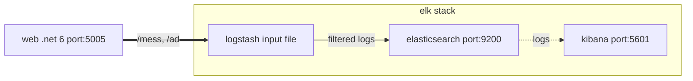

# Reason for demo

__TBC__

Gradually, more and more fields have been added to our logging.  In all reality, it is very unlikely that these fields will ever be searched on post promotion to production.  Until anything is done to eradicate this, these fields remain and will be indexed and ultimately consuming unnecessary disk space.

We can programmatically change all of our applications to reduce or eradicate the creation of these unnecessary fields, maybe by a features switch or by the environment, but this will take time and will likely involve more than one developer.

To address this, outside of programmatically time-consuming code changes, a far simpler and quicker solution is needed.

Let's briefly look at the types of fields that need to be removed from our logging. We know of two types. These being:
- non-wildcard nested field (eg Properties.ApplicationData). Let's call this uc-1
- field with a variant part (eg Message-1). Let's call this uc-2

For our on-premise workloads, we're still using our ELK stack to ship logs.  We ship these logs to Logz.io.  Therefore, the ELK application where we needed to make a change is Logstash.  This change will be a declarative configuration change.  

Fitler for uc-1:

```yml
filter {
  mutate {
    remove_field => [
      "[Properties][ApplicationData]",       
      "[Properties][QuotesRequest]"
    ]
  }
}
```

Filter for uc-2:

```yaml
filter {
  ruby {
    code => '
      event.to_hash["Properties"].to_hash.keys.each { |v|        
        if v.is_a? String and v.start_with?("Message-")
          puts v          
          event.remove("[Properties][#{v}]")
        end
      }
    '
  }
}
```

The docker-compose manifest shares a volume across our application and Logstash.  This makes it easier for me to demonstrate this change. I'm also using an input file directive, whereas in contrast, we're actually using Filebeat.  For bravity, I'm omitting Filebeat here.

---
 
## Architecture overview



---

To build then run:

```powershell
docker-compose up --build
```

```powershell
http://localhost:5005/ad
```

```powershell
http://localhost:5005/mess
```